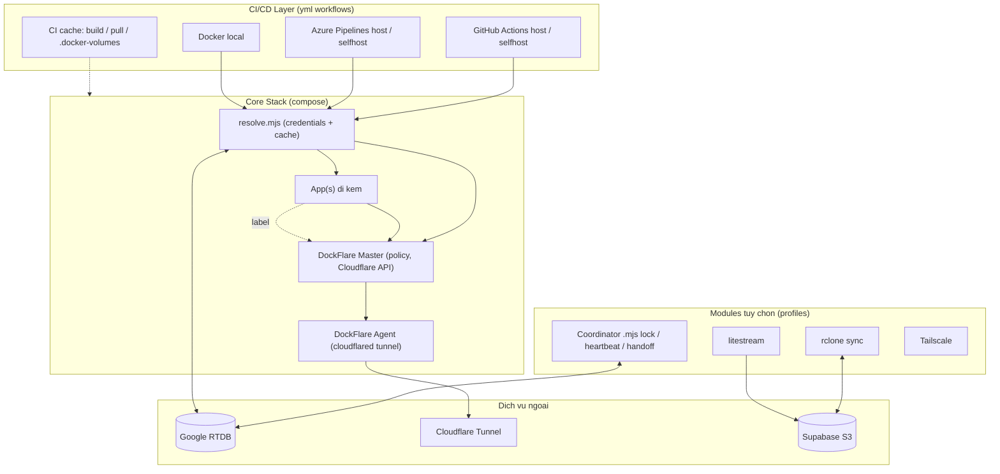
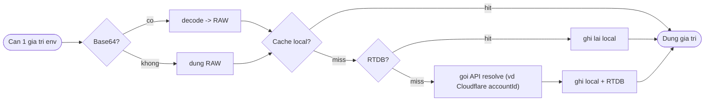
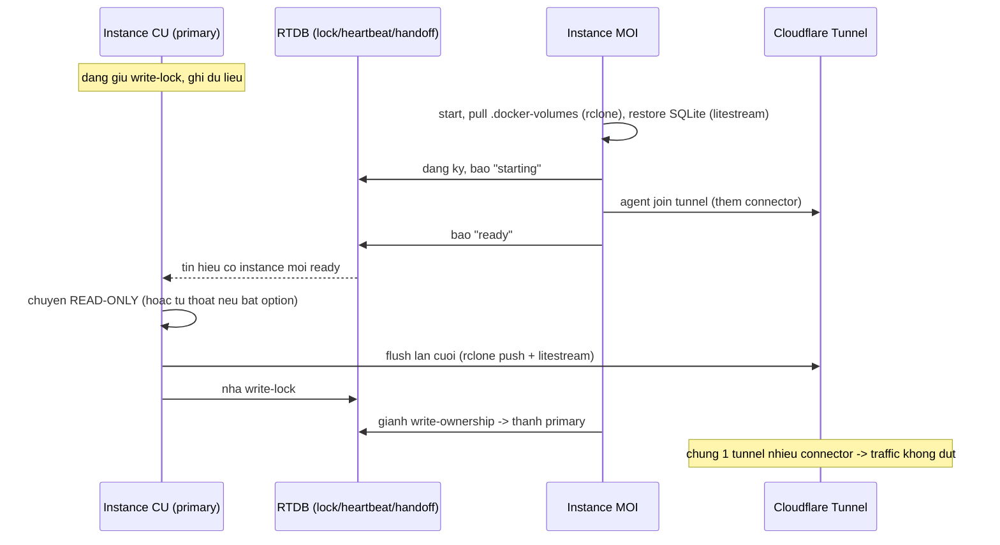

# DockFlareStack Template - Kien truc tong the

> Trang thai: DRAFT de xac nhan. Chua di sau implementation, tai lieu nay chot buc tranh lon.

## 1. Muc tieu

Mot **template deploy da app** (source code / docker / npx) chay duoc tren nhieu moi truong CI/CD (GitHub Actions host & selfhost, Azure Pipelines host & selfhost, Docker local), voi triet ly **uu tien cau hinh hon code**. Code chi xuat hien o phan bat buoc (resolve credentials, coordinator lifecycle), viet bang Node `.mjs`, moi nghiep vu mot module rieng, log ro tung buoc.

## 2. Phan lop he thong

| Lop | Thanh phan | Bat/Tat |
|---|---|---|
| **Core (bat buoc)** | DockFlare (master/agent) + cac app di kem | Luon chay |
| **Config & Resolve** | Script `.mjs` resolve credentials, cache 2 tang (local -> RTDB -> API) | Luon chay |
| **Coordinator** | Lifecycle handover tren RTDB (chong restart 60 phut) | Tuy chon |
| **rclone** | Sync bulk `.docker-volumes` (pull truoc start, push khi gan het gio) | Tuy chon |
| **litestream** | SQLite realtime -> S3 Supabase | Tuy chon |
| **Tailscale** | Mang noi bo | Tuy chon |
| **Dozzle** | Log viewer realtime qua web | Tuy chon |
| **Filebrowser** | Quan ly file `.docker-volumes` qua web | Tuy chon |
| **ttyd / WebSSH** | Terminal web vao host runner | Tuy chon |

Moi module tuy chon bat bang flag env theo prefix dich vu: `COORDINATOR_ENABLE`, `RCLONE_ENABLE`, `LITESTREAM_ENABLE`, `TAILSCALE_ENABLE`, `DOZZLE_ENABLE`, `FILEBROWSER_ENABLE`, `TTYD_ENABLE`. Compose dung **profiles** de include/exclude. Thieu env -> **canh bao + tu disable**, stack van chay (graceful, khong fail-fast).

## 3. So do kien truc tong the

## 4. Luong resolve credentials

**Key trung lap** (vd `github.token` x2, `supabase.com.database` x4): thu cai dau -> **kiem tra con song khong** -> hong thi fallback sang cai ke. Chi cache gia tri **khong nhay cam** (nhu `accountId`), secret goc luon doc tu CI Secrets / Key Vault.

## 5. Luong handover 60 phut (overlapping + read-only)

Nguyen tac da chot: **con song thi chi doc**, co option de instance cu tu thoat khi cai moi len. **Chung 1 tunnel nhieu connector** de Cloudflare tu failover muot. RTDB la diem lien lac co dinh giua cac instance.

## 6. Vai tro DockFlare (Huong C)

DockFlare lo **lop mang**: master giu policy (ingress, DNS, Zero Trust) + noi chuyen Cloudflare API; agent chay `cloudflared` tren host. App chi gan label (`dockflare.enable=true`, `dockflare.hostname=...`) la tu co route, tat thi tu don. **Ta KHONG phai tu dung reverse proxy/DNS/tunnel.**

Nhung DockFlare **KHONG** lo vu handover volume/state 60 phut - phan **lifecycle do ta tu viet** (coordinator tren RTDB). Huong C = muon DockFlare cho mang, tu viet lifecycle.
