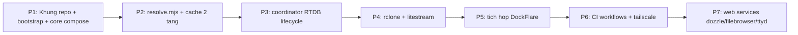

# SPEC & Ke hoach trien khai

> Trang thai: DRAFT de xac nhan. Scope dot dau: **hoan thien template truoc**, app cu the bo sung sau.

## 1. Bo tri thu muc repo

Moi dich vu nam trong thu muc rieng de de theo doi / debug / trien khai.

```
dockflarestack-template/
|- core/                        # Loi bat buoc
|  |- docker-compose.yml        # compose goc (DockFlare + app)
|  \- dockflare/                # config master/agent
|- .env.example                 # NGUON SU THAT DUY NHAT cho env (o root)
|- services/                    # Moi module 1 thu muc rieng
|  |- coordinator/              # lifecycle handover (RTDB)
|  |- rclone/
|  |- litestream/
|  |- tailscale/
|  |- dozzle/                   # log viewer
|  |- filebrowser/              # quan ly file volume
|  \- ttyd/                     # WebSSH vao host runner
|- scripts/                     # Node .mjs, moi nghiep vu tach rieng
|  |- bootstrap.mjs             # LUON chay dau tien (resolve ${VAR}, sinh COMPOSE_PROFILES...)
|  |- resolve/                  # resolve credentials + cache 2 tang
|  |- rtdb/                     # RTDB client dung chung
|  \- lib/                      # base64->raw, logger, health-check, fallback
|- ci/                          # Overlay theo moi truong (mong)
|  |- github/                   # workflow host + selfhost
|  |- azure/                    # pipeline host + selfhost
|  \- local/                    # docker-compose.override cho local
|- .docker-volumes/             # data chung (mac dinh, configurable)
|- AGENTS.md                    # rule cho AI agent
|- package.json                 # deps: dotenv, dotenv-expand, firebase-admin, shell-quote/string-argv
\- README.md
```

## 2. SPEC tung module

### 2.1 bootstrap.mjs (`scripts/bootstrap.mjs`) - LUON chay dau tien
- **Resolve `${VAR}` long nhau** (`dotenv` + `dotenv-expand`) -> ghi `.env.resolved`; compose dung `--env-file .env.resolved`.
- **Sinh `COMPOSE_PROFILES`** tu cac `<SERVICE>_ENABLE` (luon kem `core`).
- **Hard-block:** `STACK_ID=CHANGE_ME`/rong ma bat module dung RTDB/remote -> exit non-zero.
- **Derive `RCLONE_EXCLUDE`** tu `LITESTREAM_DB_PATH` (+`-wal`/`-shm`, pattern `**/<db>`).
- **Rang buoc:** `COORDINATOR_ENABLE=true` -> ep/canh bao `DOCKFLARE_REDIS_ENABLE=true`.
- **Fail-closed check:** module bao mat thieu credential -> dung, khong start.
- **Sinh credential:** Dozzle `users.yml` (`dozzle generate`), Filebrowser `config init`+`users update`+`hash`.

### 2.2 resolve (`scripts/resolve`)
- Doc secret tu CI Secrets/env, **fallback Base64 -> RAW + validate theo ngu canh** (vd service account phai JSON.parse duoc).
- Cache 2 tang: local (`RESOLVE_CACHE_PATH`) -> RTDB (`RESOLVE_RTDB_PATH`, nhanh `resolve-cache/` tach khoi `coordinator/`) -> API. Chi cache gia tri khong nhay cam.
- Key trung: thu cai dau -> **health-check theo tung loai secret** (khong generic HTTP 200) -> fallback cai ke.
- Output: file env cho tung app. Log ro tung buoc, mask secret.

### 2.3 coordinator (`services/coordinator`) - tuy chon
- Giu tren RTDB (`/stack/${STACK_ID}/coordinator/`): write-lock (primary + fenceToken), heartbeat, handoff. Timestamp dung `{".sv":"timestamp"}` server.
- **Atomic:** Firebase Admin `runTransaction` (uu tien) hoac ETag `if-match`. KHONG GET-roi-PUT.
- **Handover:** New standby -> Old flush -> New **pull/restore lan 2** -> gianh primary. litestream force-restore theo generation.
- **Contract read-only:** ghi file `COORDINATOR_READONLY_FLAG_PATH`; app check truoc khi ghi.
- **Watcher** kich hoat handover o moc buffer (`COORDINATOR_HANDOVER_BUFFER_SEC`), flush guard theo flag.
- Canh bao/gioi han `COORDINATOR_MAX_OVERLAP` khi `AUTO_EXIT=false`.

### 2.4 rclone (`services/rclone`) - tuy chon
- Pull `.docker-volumes` truoc khi start; push khi gan het gio. `--dry-run` de test.
- **`--exclude` file SQLite** (bootstrap derive). Nguyen tac: litestream so huu SQLite, rclone so huu phan con lai.
- Config: `RCLONE_CONFIG_PATH` (uu tien) hoac `RCLONE_CONFIG_CONTENT` (KHONG gop 1 bien).

### 2.5 litestream (`services/litestream`) - tuy chon
- Restore luc start (**force theo generation**, khong chi `-if-db-not-exists`), replicate realtime -> S3 Supabase. Chi primary replicate.

### 2.6 tailscale (`services/tailscale`) - tuy chon
- Adapter: OAuth (`TAILSCALE_CLIENT_ID/_SECRET`) -> ephemeral authkey -> `TS_AUTHKEY`; `TAILSCALE_TAGS` -> `TS_EXTRA_ARGS`; `TAILSCALE_STATE_DIR` -> `TS_STATE_DIR`.

### 2.7 dozzle / filebrowser / ttyd (`services/*`) - tuy chon (module bao mat, fail-closed)
- **Dozzle** (`amir20/dozzle`): log viewer, mount `docker.sock:ro`. Simple auth can `users.yml` (sinh o bootstrap).
- **Filebrowser** (`filebrowser/filebrowser`): map `FB_*` tuong minh; `FILEBROWSER_ROOT` la container-path; DB persist; set admin password o bootstrap.
- **ttyd/WebSSH** (`tsl0922/ttyd`): CLI args dung bang tokenizer (`shell-quote`/`string-argv`); `TTYD_WRITABLE=true`; bat buoc `TTYD_CREDENTIAL`.
- Chi tiet: xem docs/04 (docs) va docs/06 (tieu chi ky thuat).

## 3. Plan thuc hien (theo giai doan)



Moi phase co **Dieu kien hoan thanh (DoD)** va **Smoke test** de tu kiem tra dung/sai truoc khi qua buoc sau.

| Phase | Noi dung | Dieu kien hoan thanh (DoD) | Smoke test |
|---|---|---|---|
| P1 | Cau truc thu muc, `bootstrap.mjs` (resolve ${VAR}->.env.resolved + sinh COMPOSE_PROFILES), core compose, `.env.example` | Tat het module tuy chon, `node scripts/bootstrap.mjs` roi compose len core xanh | `node scripts/bootstrap.mjs && docker compose --env-file .env.resolved up -d` -> `docker ps` thay DockFlare healthy. Bat flag la -> khong sap. STACK_ID=CHANGE_ME + bat coordinator -> bootstrap exit non-zero |
| P2 | `resolve.mjs`, base64->raw + validate, cache 2 tang, health-check + fallback | Resolve ra `accountId`; lan 2 doc cache khong goi API; token hong tu fallback | Set CF global key + email -> log accountId. Chay lai -> "cache hit". Doi token[0] thanh rac -> "fallback to token[1]" |
| P3 | Coordinator RTDB: lock/heartbeat/handoff, read-only contract, re-pull sau flush | Luon chi 1 primary; instance cu read-only; khong double-write; khong mat du lieu khi handover | 2 instance local. A=primary ghi duoc. Start B -> primary doi sang B, A readonly (file .readonly xuat hien). Ep A ghi -> tu choi. B pull/restore lan 2 truoc khi thanh primary |
| P4 | rclone pull/push (exclude SQLite), litestream restore/replicate force generation | Volume + SQLite ben qua restart; khong mat du lieu; rclone khong dung file SQLite | Tao test.txt + ghi 1 row SQLite -> push/replicate. Xoa local, restart -> pull + restore -> file va row quay ve. Kiem rclone KHONG dong vao app.db |
| P5 | DockFlare master/agent, chung 1 tunnel nhieu connector | App co URL public qua label; them connector khong dut; tat app tu don rule | Gan label cho app whoami -> truy cap hostname ra app. Start instance 2 cung tunnel -> curl khong rot. Tat app -> rule tu xoa |
| P6 | Reusable workflow + matrix, CI cache o tang yml, tailscale | Deploy tren GH + Azure + local tu 1 core; CI cache hit; tailscale join | Chay workflow 2 lan -> lan 2 cache hit. `tailscale status` thay node; ping node khac qua IP 100.x |
| P7 | Web services: Dozzle, Filebrowser, ttyd (bat/tat, fail-closed) | Moi service bat bang flag rieng, tat thi stack van chay; thieu credential -> khong start | Dozzle: hello-world -> log realtime (co users.yml). Filebrowser: file host <-> UI dong bo, password set tu bootstrap. ttyd: whoami dung host runner, thieu credential -> khong start |

Ly do thu tu: dung khung + bootstrap + resolve + coordinator + data (phan template cot loi) truoc; DockFlare va workflow ghep sau.

## 4. Diem chot da thong nhat
- Uu tien cau hinh hon code; code toi thieu, log ro; toan bo script `.mjs`, tach rieng tung nghiep vu.
- Core = DockFlare + app; **7 module tuy chon** (coordinator, rclone, litestream, tailscale, dozzle, filebrowser, ttyd) bat-tat doc lap qua flag `<SERVICE>_ENABLE`.
- **Graceful 2 lop:** module thuong thieu env -> tu disable (fail-open); module bao mat (ttyd/dozzle/filebrowser) thieu credential -> fail-closed khong start.
- **`bootstrap.mjs` bat buoc:** resolve `${VAR}` -> `.env.resolved`, sinh `COMPOSE_PROFILES`, hard-block `STACK_ID`, derive `RCLONE_EXCLUDE`, rang buoc Redis<->coordinator.
- Fallback Base64 -> RAW + validate theo ngu canh cho moi env.
- Path ben vung derive tu `${DOCKER_VOLUMES_DIR}`; `STACK_ID`/`TUNNEL_NAME`/`RCLONE_PATH` khong de hang dung chung.
- Con song thi read-only (contract file `.readonly`); chung 1 tunnel nhieu connector; handover pull/restore lan 2 sau khi Old flush.
- RTDB namespace tach `coordinator/` vs `resolve-cache/`; litestream so huu SQLite, rclone `--exclude` SQLite.
