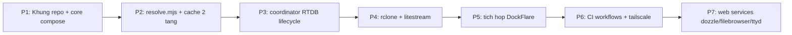

# SPEC & Ke hoach trien khai

> Trang thai: DRAFT de xac nhan. Scope dot dau: **hoan thien template truoc**, app cu the bo sung sau.

## 1. Bo tri thu muc repo

Moi dich vu nam trong thu muc rieng de de theo doi / debug / trien khai.

```
dockflarestack-template/
|- core/                        # Loi bat buoc
|  |- docker-compose.yml        # compose goc (DockFlare + app)
|  |- .env.template             # khai bao moi env (cung cap sau)
|  \- dockflare/                # config master/agent
|- services/                    # Moi module 1 thu muc rieng
|  |- coordinator/              # lifecycle handover (RTDB)
|  |- rclone/
|  |- litestream/
|  |- tailscale/
|  |- dozzle/                   # log viewer
|  |- filebrowser/              # quan ly file volume
|  \- ttyd/                     # WebSSH vao host runner
|- scripts/                     # Node .mjs, moi nghiep vu tach rieng
|  |- resolve/                  # resolve credentials + cache 2 tang
|  |- rtdb/                     # RTDB client dung chung
|  |- lib/                      # base64->raw, logger, health-check, fallback
|  \- bootstrap.mjs             # dieu phoi thu tu khoi dong
|- ci/                          # Overlay theo moi truong (mong)
|  |- github/                   # workflow host + selfhost
|  |- azure/                    # pipeline host + selfhost
|  \- local/                    # docker-compose.override cho local
|- .docker-volumes/             # data chung (mac dinh, configurable)
|- AGENTS.md                    # rule cho AI agent
\- README.md
```

## 2. SPEC tung module

### 2.1 resolve (`scripts/resolve`)
- Doc secret tu CI Secrets/env, fallback Base64 -> RAW cho moi gia tri.
- Cache 2 tang: local file -> RTDB -> API. Chi cache gia tri khong nhay cam.
- Key trung: thu cai dau -> health-check -> fallback cai ke.
- Output: file env cho tung app. Log ro tung buoc resolve.

### 2.2 coordinator (`services/coordinator`) - tuy chon
- Giu tren RTDB: write-lock (primary), heartbeat, handoff signal.
- Instance moi ready -> gianh ownership; instance cu -> read-only (hoac tu thoat neu bat option).
- Watcher dem nguoc theo thoi diem start job de flush kip.

### 2.3 rclone (`services/rclone`) - tuy chon
- Pull `.docker-volumes` truoc khi start app; push khi gan het gio.

### 2.4 litestream (`services/litestream`) - tuy chon
- Restore SQLite luc start, replicate realtime -> S3 Supabase.

### 2.5 tailscale (`services/tailscale`) - tuy chon
- Chi dung `tailscale.com.TrustCredentials` trong qua trinh cau hinh.

### 2.6 dozzle / filebrowser / ttyd - tuy chon
- Dozzle (`amir20/dozzle`): log viewer realtime, mount `docker.sock:ro`.
- Filebrowser (`filebrowser/filebrowser`): quan ly file trong `.docker-volumes`.
- ttyd/WebSSH (`tsl0922/ttyd`): terminal web vao host runner, bat buoc co auth.
- Chi tiet: xem `04-dich-vu-chi-tiet.md`.

## 3. Plan thuc hien (theo giai doan)



Moi phase co **Dieu kien hoan thanh (DoD)** va **Smoke test** de tu kiem tra dung/sai truoc khi qua buoc sau.

| Phase | Noi dung | Dieu kien hoan thanh (DoD) | Smoke test |
|---|---|---|---|
| P1 | Cau truc thu muc, core compose, `.env.template`, profiles | Tat het module tuy chon, `docker compose up` core len xanh | `docker compose --profile core up -d` -> `docker ps` thay DockFlare healthy; bat flag la van khong sap |
| P2 | `resolve.mjs`, base64->raw, cache local, health-check + fallback | Resolve ra `accountId`; lan 2 doc cache khong goi API; token hong tu fallback | Set CF global key + email -> log accountId. Chay lai -> "cache hit". Doi token[0] thanh rac -> "fallback to token[1]" |
| P3 | Coordinator RTDB: lock/heartbeat/handoff, read-only switch | Luon chi 1 primary; instance cu chuyen read-only; khong double-write | 2 instance local. A=primary ghi duoc. Start B -> primary doi sang B, A readonly. Ep A ghi -> bi tu choi. Kill B -> A gianh lai |
| P4 | rclone pull/push, litestream restore/replicate | Volume + SQLite ben qua restart; khong mat du lieu | Tao `test.txt` + ghi 1 row SQLite -> push/replicate. Xoa local, restart -> pull + restore -> file va row quay ve |
| P5 | DockFlare master/agent, chung 1 tunnel nhieu connector | App co URL public qua label; them connector khong dut; tat app tu don rule | Gan label cho app whoami -> truy cap hostname ra app. Start instance 2 cung tunnel -> curl khong rot. Tat app -> rule tu xoa |
| P6 | Reusable workflow + matrix, CI cache o tang yml, tailscale | Deploy tren GH + Azure + local tu 1 core; CI cache hit; tailscale join | Chay workflow 2 lan -> lan 2 cache hit. `tailscale status` thay node; ping node khac qua IP 100.x |
| P7 | Web services: Dozzle, Filebrowser, ttyd (bat/tat) | Moi service bat bang flag rieng, tat thi stack van chay; co auth khi expose | Dozzle: `docker run hello-world` -> log realtime. Filebrowser: file host <-> UI dong bo. ttyd: `whoami` dung host runner |

Ly do thu tu: dung khung + resolve + coordinator + data (phan template cot loi) truoc; DockFlare va workflow ghep sau vi phu thuoc cac khoi kia.

## 4. Diem chot da thong nhat
- Uu tien cau hinh hon code; code toi thieu, log ro.
- Core = DockFlare + app; cac module tuy chon bat-tat doc lap qua flag.
- Thieu env -> canh bao + tu disable, khong fail-fast.
- Toan bo script `.mjs`, tach rieng tung nghiep vu.
- Fallback Base64 -> RAW cho moi env.
- Con song thi read-only; chung 1 tunnel nhieu connector.
